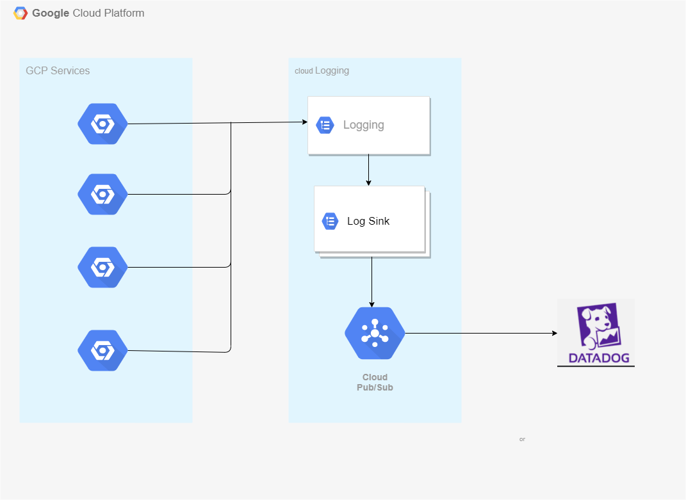
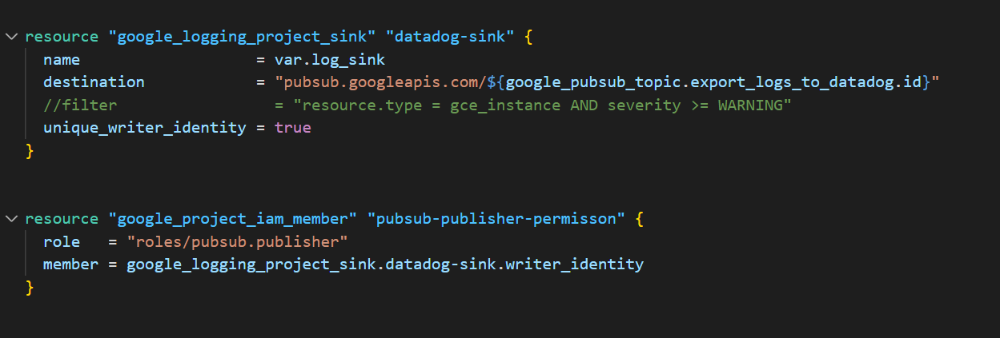
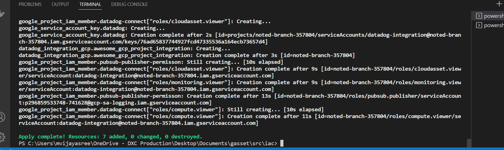
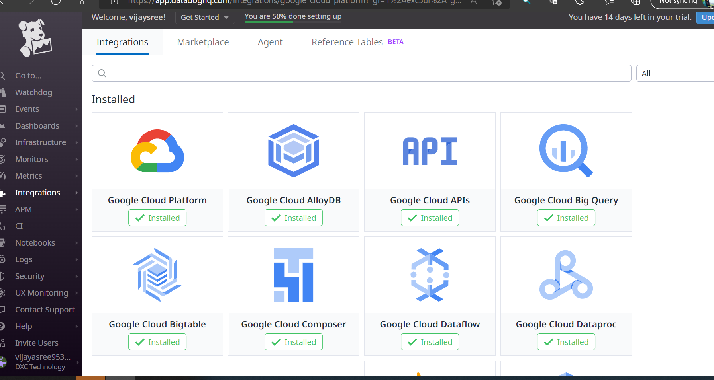
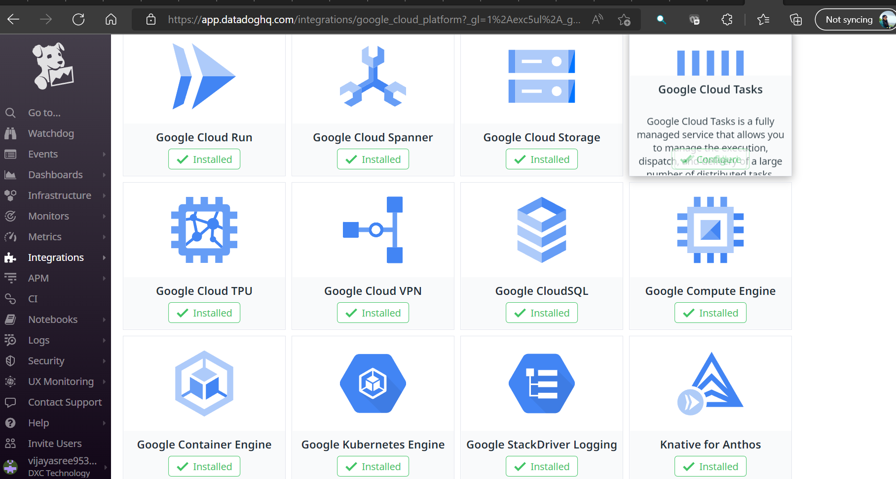
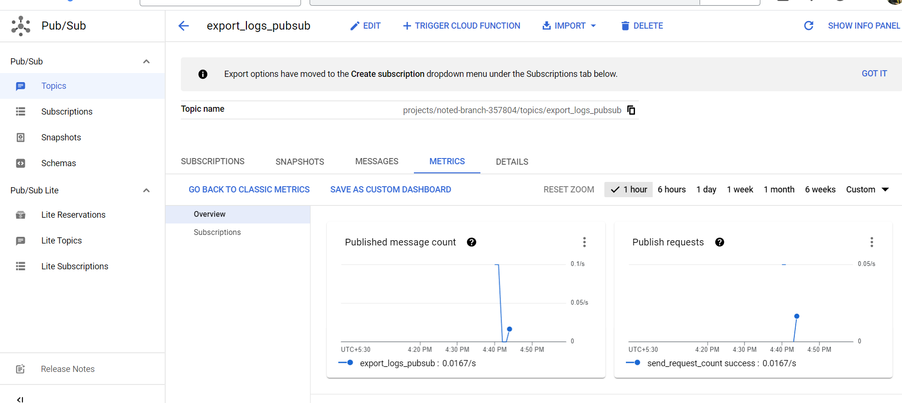
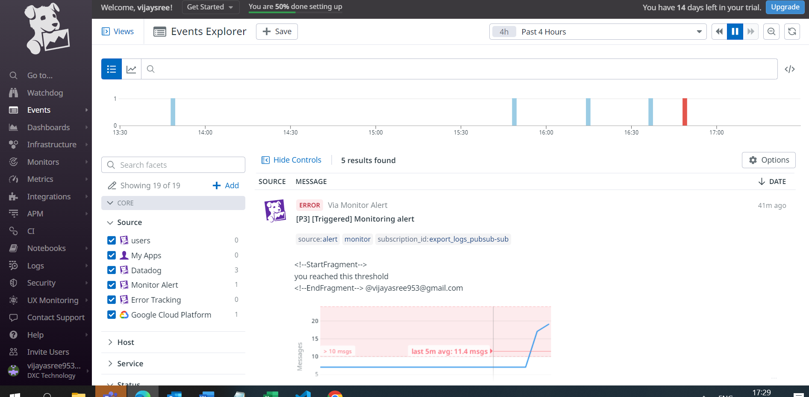
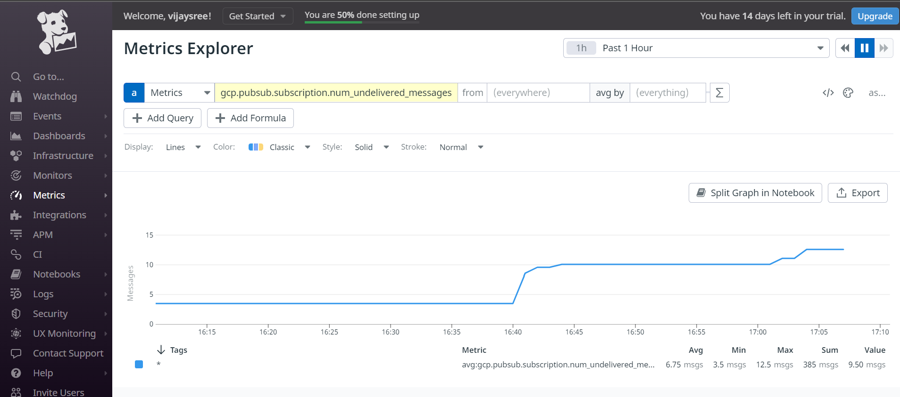

# GCP INTEGRATION WITH DATADOG AND EXPORTING LOGS  USING TERRAFORM 

# 1.1 Overview
•	We can review the health of the environment via the consolidated dashboard. Having a single platform for monitoring all kinds of infrastructure is helpful. Datadog  is monitoring and analytics tool to determine performance metrics as well as event monitoring for infrastructure and cloud services. Its best for network monitoring, infrastructure management, and application monitoring solution. 

•	Datadog's GCP integration is built to collect ALL metrics from Google Cloud Logging. Datadog strives to continually update the docs to show every sub-integration, but cloud services rapidly release new metrics and services so the list of integrations are sometimes lagging.

# 1.2 Scope

•	This document provides the procedures to be followed for integration of gcp with datadog and exporting logs from gcp services to datadog using terraform

# creating service account through Terraform 

 Below are instructions for creating a service account and providing Datadog with service account credentials. And Google Cloud billing, the Cloud Monitoring API, the Compute Engine API, and the Cloud Asset API must all be enabled for the project(s) you wish to monitor.

Google Cloud billing, the Cloud Monitoring API, the Compute Engine API, and the Cloud Asset API must all be enabled for the project.

 Add the following roles to service account: Compute Viewer, Monitoring Viewer, and Cloud Asset Viewer.

# Integrating Google Cloud Platform with datadog through terraform

 After creating service account, by providing all the arguments from the service account, datadog integrates with gcp   

# Export  logs to pubsub 

 Export Logs from cloud logs explorer by creating a sink and by selecting Cloud Pub/Sub as the destination

# Exporting cloud logs to Datadag

GCP service logs are collected with Google Cloud Logging and sent to a Cloud Pub/Sub. The log collection requires following steps:

1.Create a new Cloud Pub/Sub topic with push and pull.

2.Setup the Pub/Sub to forward logs to Datadog.

3.Configure exports from Google Cloud logs by creating sink by selecting pubsub as destination.

4.Pubsub topic push logs to the datadog by providing the destination URL in the push endpoint argument.

5.Once logs have been exported to the datadog we can monitor, create metrics,  service events.

# Deployment:

To initialize terraform run below command in working directory

•	terraform init

To validate you code run

•	terraform validate

To check the configuration run

•	terraform plan

When plan looks good to proced then terraform apply that executes the terraform code.

•	terraform apply --auto-approve

# OUTCOMES:
•	Terraform output  that how many resources that are created in the gcp 

//

•	Datadog Integrated with gcp with all gcp services via terraform 

//
//

•	Cloud Logs exported to pubsub topic

//

•	Exported logs from gcp to Datadog by seeing in the events explorer

//

•	Created metric in the datadog 

//

