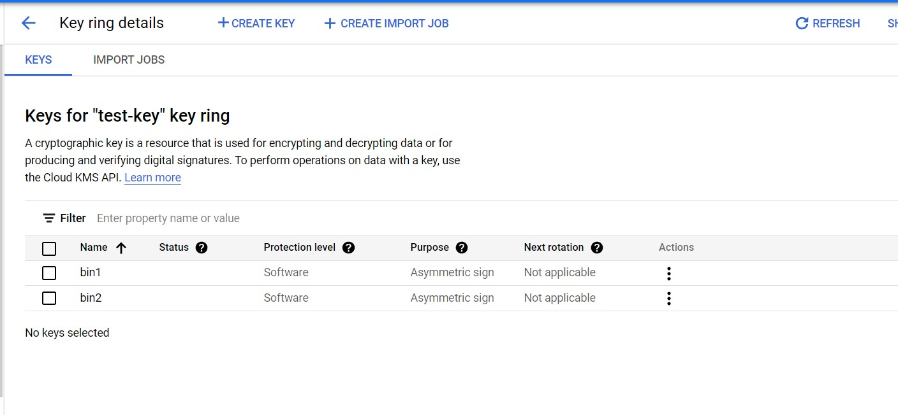
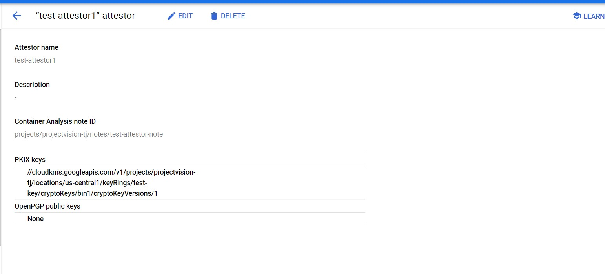
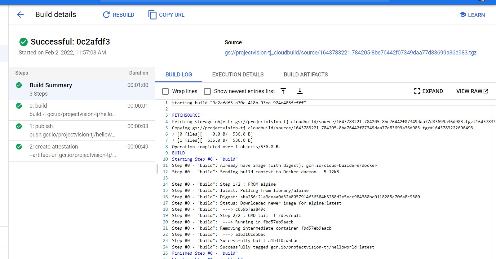
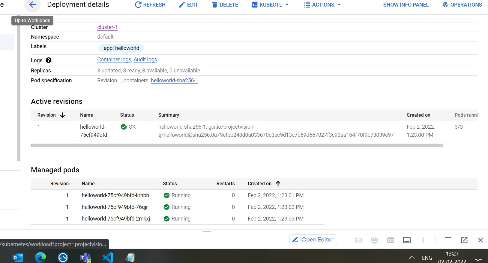
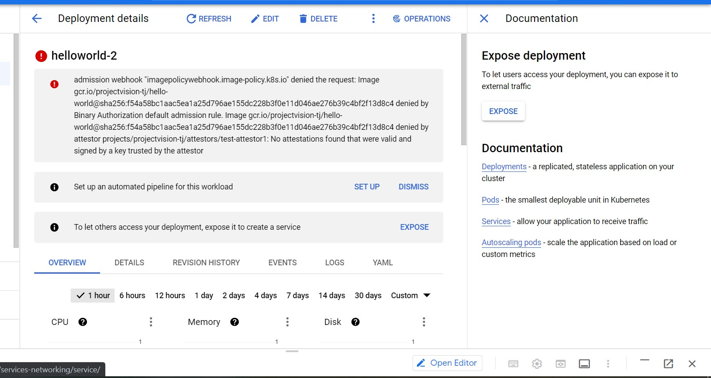

## Binary Authorization for Google Kubernetes Engine 

### PROBLEM STATEMENT

we either maliciously or accidentally deploy untrusted code in to the gke.

Binary Authorization aims to reduce the risk of deploying defective, vulnerable, or unauthorized software in the environment. Using this service, you can prevent images from being deployed unless it satisfies a policy you define.

### 1. INTRODUCTION

Binary Authorization is a deploy-time security control that ensures only trusted container images are deployed on Google Kubernetes Engine (GKE) or Cloud Run. 
With Binary Authorization, you require images to be signed by trusted authorities during the development process and then enforce signature validation when deploying.

 
 
 
Use an asymmetric key you manage in Cloud Key Management Service to sign images for signature verification and use the key in attestation creation and then change the binary authorization policies.

#  step1 - creating Cloud Key Management Service key ring
 
Creating a KMS keyring by giving name and specfic location and purpose can be asymmetric sign or symmetric sign and specifing version template a template describing settings for new crypto key versions will be the algorithm to use when creating a version based on this template. 

## by giving all the arguments 

resource "google_kms_key_ring" "my_key_ring" {
  
  name     =  var.key_ring 
  
  location =  var.location 

}

resource "google_kms_crypto_key" "my_crypto_key" {

  count    = length(var.crypto_key)

  name     = var.crypto_key[count.index]

  key_ring = google_kms_key_ring.my_key_ring.id

  purpose  = var.purpose

  version_template {

    algorithm = var.algorithm 

  }

}

#  step2 -   creating attestation

You can create attestors with Cloud Key Management Service key id . An attestor represents an authority that can verify or attest to one aspect of an image. Create attestor by giving name for the attestor and attestation authority note is created by using  resource "google_container_analysis_note" and its require  key version id from the above created KMS key ring.

## by giving all the arguments  

resource "google_binary_authorization_attestor" "attestor" {

   count  = length(var.attestor_name)
  
  name = var.attestor_name[count.index]
  
  attestation_authority_note {
   
   note_reference = google_container_analysis_note.note.name
    public_keys {
  
  id  = data.google_kms_crypto_key_version.version.id
  
  pkix_public_key {
  
  public_key_pem  = data.google_kms_crypto_key_version.version.public_key[0].pem
       
  signature_algorithm = data.google_kms_crypto_key_version.version.public_key[0].algorithm
      
  }
    
  }

}

}

resource "google_container_analysis_note" "note" {
  name = "test-attestor-note"
  attestation_authority {
    hint {
      human_readable_name = "Attestor Note"
    }
  }
}

data "google_kms_crypto_key_version" "version" {
  crypto_key = var.crypto_key_id
}

# step3 - creating Binary Authorization Policy 

This policy determines whether Binary Authorization allows an image to be deployed by your platform (e.g. GKE and Cloud Run).

Default rule :

The default rule determines whether container images are allowed to be deployed unless the rule is overridden by specific rules or exempt images.

resource "google_binary_authorization_policy" "policy" {
  
  default_admission_rule {
  
    evaluation_mode         = "REQUIRE_ATTESTATION"
  
    enforcement_mode        = "ENFORCED_BLOCK_AND_AUDIT_LOG"
   
    require_attestations_by = var.attestor_id
  
  }

  
global_policy_evaluation_mode = "ENABLE"

}

Specific rules :

You can define specific rules that override the Default Rule for this project. You can create multiple specific rules but they must be of the same type.

resource "google_binary_authorization_policy" "policy" {
  
  cluster_admission_rules {

    cluster                 = var.cluster_name
  
    evaluation_mode         = "REQUIRE_ATTESTATION"
  
    enforcement_mode        = "ENFORCED_BLOCK_AND_AUDIT_LOG"
   
    require_attestations_by = var.attestor_id
  
  }

  
global_policy_evaluation_mode = "ENABLE"

}

# Adding attestation to the container image using cloud build 

This setup helps ensure that only container images built and signed as part of the Cloud Build build process are automatically authorized to run in your deployment environment.

step1- Code to build the container image is pushed to a source repository, such as Cloud Source Repositories.
 
step2- A continuous integration (CI) tool, Cloud Build builds and tests the container.

step3-  The build pushes the container image to Container Registry that stores your built images
## after
 - id: 'build'
    name: 'gcr.io/cloud-builders/docker'
    args:
      - 'build'
      - '-t'
      - 'gcr.io/$PROJECT_ID/helloworld:latest'
      - '.'
  - id: 'publish'
    name: 'gcr.io/cloud-builders/docker'
    args:
      - 'push'
      - 'gcr.io/$PROJECT_ID/helloworld:latest'

step4-  Cloud Key Management Service, which provides key management for the cryptographic key pair, signs the container image. The resulting signature is then stored in a newly created attestation. These values are must replace ATTESTOR_NAME,  and KMS_KEY_VERSION 
## before
- id: 'create-attestation'
  name: 'gcr.io/${PROJECT_ID}/binauthz-attestation:latest'
  args:
    - '--artifact-url'
    - 'gcr.io/${PROJECT_ID}/helloworld:latest'
    - '--attestor'
    - 'projects/${PROJECT_ID}/attestors/ATTESTOR_NAME'
    - '--keyversion'
    - 'projects/${PROJECT_ID}/locations/KMS_KEY_LOCATION/keyRings/KMS_KEYRING_NAME/cryptoKeys/KMS_KEY_NAME/cryptoKeyVersions/KMS_KEY_VERSION'
## after
id: 'create-attestation'
    name: 'gcr.io/$PROJECT_ID/binauthz-attestation:latest'
    args:
      - '--artifact-url'
      - 'gcr.io/projectvision-tj/helloworld:latest'
      - '--attestor'
      - 'projects/projectvision-tj/attestors/test-attestor1'
      - '--keyversion'
      - 'projects/projectvision-tj/locations/us-central1/keyRings/test-key/cryptoKeys/bin1/cryptoKeyVersions/1'

   
outcomes :

Terraform outputs:

1. Created KMS Key ring with two cryptokeys with key version

 

2. Created attestor with KMS Version keys

 

3. Updated binary authorization policy 

 

4. cloud build got successfully build

 

5. verification of Binary authorization

 Deployed successfully only the authorised image which has attestation that attached to it

 

Stopped deployment of unauthorised image which is not attached with any attestation

