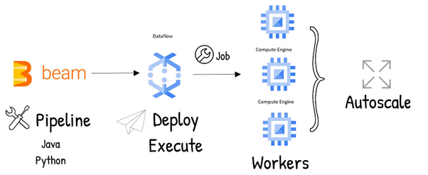
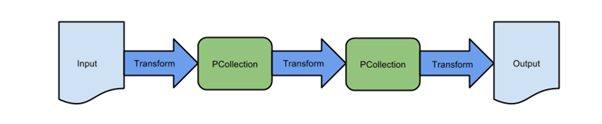
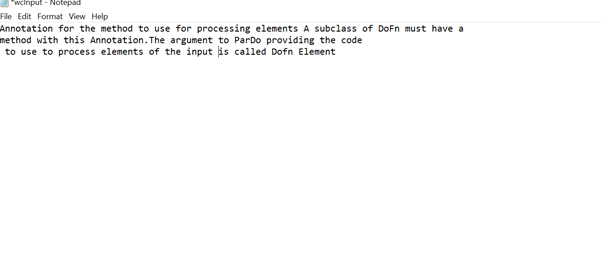
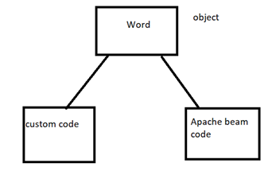
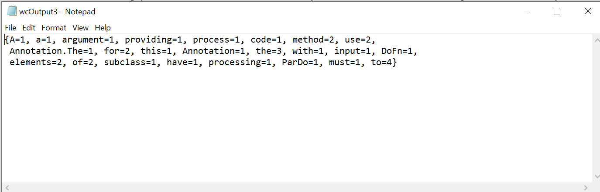
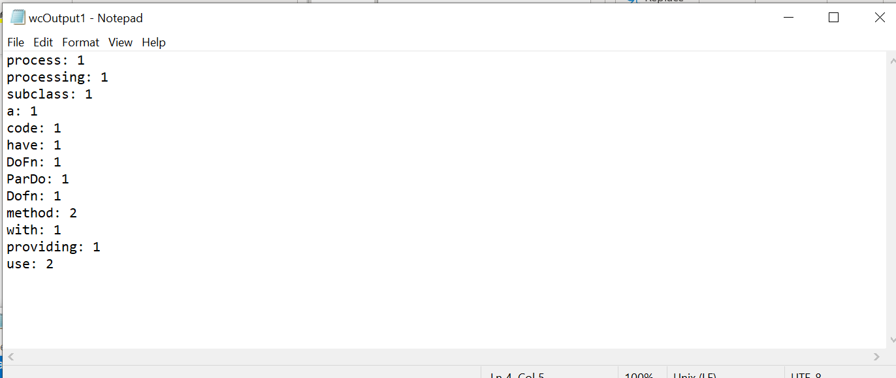

# WordCount Dataflow Pipeline

•	Wordcount Pipeline involves series of steps for collecting the input data from source file path and processing the elements of data based on defined user processing logic and transforming ouput pcollection into the destination sink. Here the input source is text file from local machine and the output destination is local path.

•	Wordcount Pipeline counts the every word  that how many a times every word is repeated in a given input file 
by using Pardo function that is user defined function and writes to the destination output file locally.

•	Once you created the pipeline using apache beam SDK in the language of our choice, then we can use dataflow to deploy and execute that pipeline which created dataflow jobs. Dataflow then assigns the virtual machines to execute the data processing. Dataflow can automatically increase or decrease the instances required to run the job.

# Data Processing steps in Apache Beam

The below are the steps that are involved in Apache Beam SDK for data processing 

# Workflow 

Step 1 : Initializing the Pipeline by providing the required configurations using below command 

Pipeline p = Pipeline.create(options);

Step 2 : Reading the Input raw data from the source file. By using text.io operator is a PTransform that reads from one or more text files and returns a bounded PCollection containing one element for each line of the input files.

 PCollection<String> word = p.apply("ReadLines", TextIO.read().from(InputFile));

 

step 3 : Applying Transformation or processing logic on the input data by using PARDO user defined function.

 word.apply("count the words", ParDo.of(new CountWord()))

 

Here word is an object used to run two different codes one is the custom code using pardo function and another is the Apache Beam code

Step 4 : Writing the data to the destination sink  by using Textio.write() operator

.apply("WriteCounts", (TextIO.write().to(OutputFile)));

output for the custom transform code

 

Output for the Apache Beam code

 

# Dataflow Template Code using Apache Beam SDK 

package com.dxc.pipeline;

import java.util.Arrays;

import java.util.HashMap;

import java.util.Map;

import org.apache.beam.sdk.Pipeline;

import org.apache.beam.sdk.io.TextIO;

import org.apache.beam.sdk.options.PipelineOptions;

import org.apache.beam.sdk.options.PipelineOptionsFactory;

import org.apache.beam.sdk.transforms.*;

import org.apache.beam.sdk.values.KV;

import org.apache.beam.sdk.values.PCollection;

import org.apache.beam.sdk.values.TypeDescriptors;

public class wordcountpipeline {

    public static class CountWord extends DoFn<String, String> {

        @ProcessElement

        public void processElement(ProcessContext c) {

            Object inputObj = c.element();

            String[] b = String.valueOf(inputObj).split("[^a-zA-Z]");

            Map<String, Integer> map = new HashMap<();

            for (int i = 0; i < b.length; i++) {

                if (!map.containsKey(b[i])) {

                    map.put(b[i], 1);

                } else {

                    map.put(b[i], map.get(b[i]) + 1);

                }

                //KV.of(b[i],map.get(b[i]) + 1);

            }

            c.output(map.toString());

            System.out.print(map);

        }
    }

    public static void main(String[] args) {

        String InputFile = "C:\\dataflow\\wcInput.txt";

    
        String OutputFile = "C:\\dataflow\\wcOutput3.txt";

        String OutputFile1 ="c:\\dataflow\\wcOutput1.txt";

PipelineOptions options = PipelineOptionsFactory.fromArgs(args).withValidation().create();

        Pipeline p = Pipeline.create(options);

        PCollection<String> word = p.apply("ReadLines", TextIO.read().from(InputFile));

        word.apply("count the words", ParDo.of(new CountWord()))

        .apply("WriteCounts", (TextIO.write().to(OutputFile)));

        word.apply(FlatMapElements.into(TypeDescriptors.strings())
                                .via((String line) -> Arrays.asList(line.split("[^\\p{L}]+"))))

                .apply(Filter.by((String word2) -> !word2.isEmpty()))

                .apply(Count.perElement())

                .apply(
                        MapElements.into(TypeDescriptors.strings()).via( (KV<String,Long> wordCount) ->
                                     wordCount.getKey() + ": " + wordCountgetValue()))
                .apply(TextIO.write().to(OutputFile1));

        p.run();

    }

}

# Execution 

We can execute the pipeline using various paths fo testing purpose we can use DirectRunner which executes the Pipeline locally and then we can use execution engine as dataflow and  run dataflow jobs.

